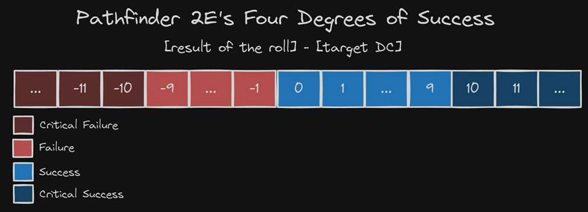

# PathFinder 2E DiceRoll - AppServer

This is a WebApp that checks odds for a D20 RPG Dice and returns those odds based on
Pathfinder 2E rules that configures as Four Degrees of Succes:

## Technologies

- GO Language - Open-source Programming Language.

- Docker - Containerization platform that bundle applications in containers.

- GIN - A fast web framework for Go with good performance and support for middlewares.

## Installation

1. Install Go from:
  https://go.dev/dl/

  *Installation may vary accordingly to the OS being used.

2. Clone repository:
  git clone https://github.com/felipezoltowski/hp-goserver-test.git

2. Navigate into project directory:
  cd go-server

3. Build the docker image
  docker build -t go-webserver .

5. Run the docker image
  docker run -p 8080:8080 go-webserver

6. On your browser, access:
  http://localhost:8080/api/pathfinder2e/v1/distribution?modifier=50&dc=1
